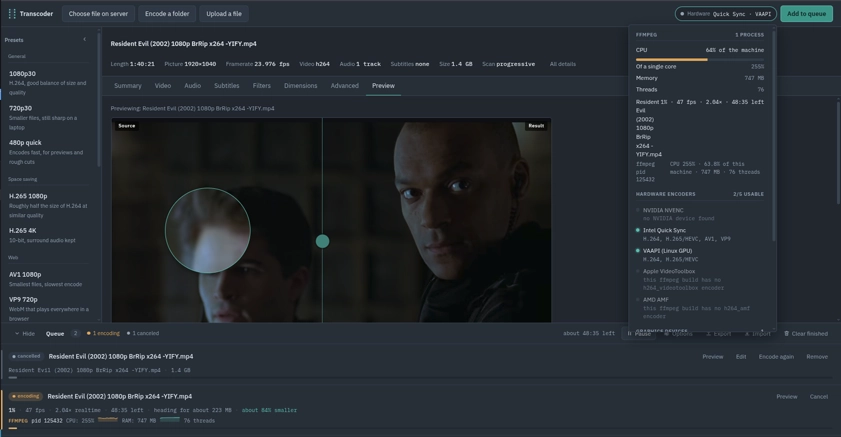
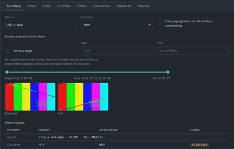
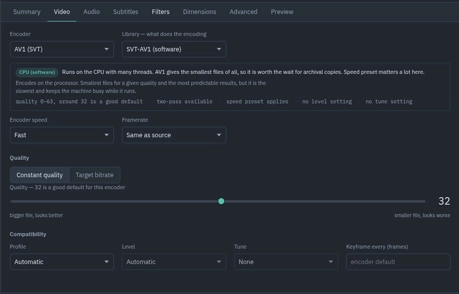
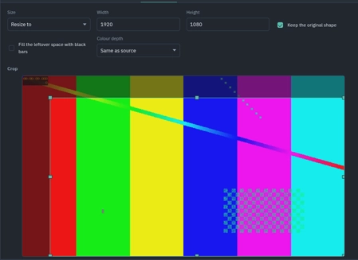
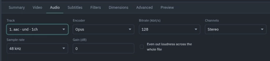
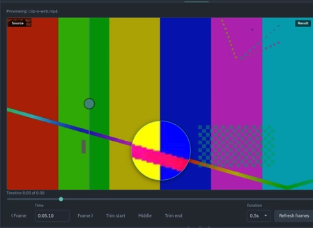
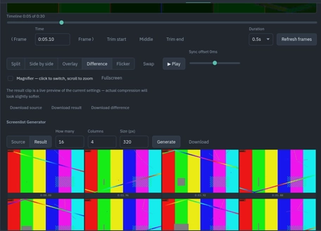

A single Go binary that serves a browser UI for transcoding video. Presets,
a settings panel per topic, batch encoding of whole folders, a queue that
survives a crash, output verification, and post-encode actions.

The Go side never reimplements encoding - it builds ffmpeg command lines,
supervises the process, parses `-progress` output and pushes updates to the
browser over server-sent events.

<br clear="left" />

## Preview

The main panel with the queue, the settings panes, the frame inspector and the
live hardware report:

<p align="center">
  
</p>

## Getting started

You can use docker or prebuilt binaries.

Note that docker containers include a build of ffmpeg and fprobe v9

There are multiple docker containers and you may chose one, by default, the `latest` and `<version>` tags
are basic ffmpeg builds with no HW acceleration. you can see the list of all containers in [this](./docs/container-tags.md) file

```sh
docker run --rm -p 8723:8723 -v "$PWD/:/data" ghcr.io/fmotalleb/ffmpeg-web:latest
# or safer version, that runs as invoker, must be executed inside user's own directories to be able to create files under PWD
docker run --user "$(id -u)" --rm -p 8723:8723 -v "$PWD/:/data" ghcr.io/fmotalleb/ffmpeg-web:latest
```

Running this creates `./encoded` directory and the tool stores its data (queue, output files, presets ...) under this directory
[read this section for more information on production deployments](#if-you-deploy-it-beyond-localhost)

## Sections

## Deciding what changes

The Summary tab ends with a recap of the encode written as "what the file is
now, and what it will become": codec, rate control and frame rate, picture size
and pixel format, filters, audio, subtitles, length, container. Lines the encode
leaves alone are marked "unchanged" rather than left out, so it is as clear what
will not be touched as what will, and each changed line carries a word for the
change — `re-encoded`, `resized`, `trimmed`, `burned in`, `removed` and so on.
Nothing is claimed without its "before": the picture line reads
`1920×1080 → 1912×1076` rather than only the target. The rules live in
`web/src/recap.ts`; the panel only renders them.

<p align="center">
  
</p>

### Video settings

<p align="center">
  
</p>

### Dimensions and pixel format

<p align="center">
  
</p>

### Audio settings

<p align="center">
  
</p>

## Batch encoding

Pick a folder instead of a file and every video under it is queued, with the
folder tree rebuilt underneath the output directory:

```
~/Videos/Season1/ep01.mkv     ->  ~/encoded/Season1/ep01.mp4
~/Videos/Season1/Extras/x.mp4 ->  ~/encoded/Season1/Extras/x.mp4
```

Files are not probed at queue time — a thousand files would mean a thousand
ffprobe calls before anything started encoding. Each worker probes its own file
as it picks it up, so length and size appear per job when it begins. "Skip files
that already have a result" makes re-runs of a partly finished folder cheap.

## The queue survives a crash

Everything — jobs, order, settings, the paused flag — lives in `queue.json`
next to the encodes. Writes are coalesced to at most one per 700ms and go
through a temp file plus rename, so a kill at any moment leaves a valid file.

On startup, any job that was `running` when the process died is reset to
`queued` and its half-written output is deleted, so that file is encoded again
from the beginning rather than left as a broken stub. Finished, failed and
waiting jobs come back untouched. Export and import move a queue between
machines; imported jobs are re-validated against `-root` and come back as
waiting regardless of the state they were exported in.

## Checking the result

When verification is on (the default) each finished file is re-probed and must
pass all of: ffprobe opens it, there is a usable video track, the length matches
what was asked for within 2%, and the last five seconds actually decode. That
last check is what catches an interrupted write — a truncated MP4 often still
has a readable header. A file that fails is marked failed with the reason
attached, and is kept so you can look at it.

## Deleting sources

A finished job that shrank by at least the threshold (20% by default) gets a
"Delete source" button showing the actual saving. Turn on the automatic version
in queue options to have it happen without asking. Either way the source only
goes if the output passed verification and the source sits inside `-root`.

## After the queue empties

One action fires when the last job finishes: nothing, a `POST` to a URL with a
summary of the run, or a shell command. The command option needs
`-allow-commands` at startup — without it the server refuses to store one — and
runs with `TRANSCODER_DONE`, `TRANSCODER_FAILED` and `TRANSCODER_OUTDIR` in its
environment.

## Hardware status

The "Hardware" chip in the top bar says what the machine can do before you
queue anything. It lists each hardware encoder family — NVENC, Quick Sync,
VAAPI, VideoToolbox, AMF — with the codecs that work here and the reason the
rest do not, keeping "this ffmpeg build has no such encoder" apart from "there
is no such card in this box". The graphics devices it found (with their kernel
driver), the CPU model, load average and memory are listed below that.

It also shows what ffmpeg is using at this moment: the CPU percentage of the
live ffmpeg processes, taken from two samples of their `/proc` counters a few
seconds apart, so it is the current rate rather than an average since startup —
along with their memory, thread count, and each running job's fps, speed and
ETA. Load and memory come from `/proc` as well, so on hosts without it only the
encoder and device parts are filled in.

The queue's own encodes are reported against the job that started them. The
manager remembers the PID of each ffmpeg it launches, so a running job row
shows that process — its PID, CPU, memory and thread count, with a short live
sparkline of both — rather than averages over whatever else happens to be
running on the machine; the same attribution labels the processes in the
hardware popover. The sparklines cover the last two minutes, and the CPU one is
scaled to whole cores, so its dashed line is a single core.

## Frame inspector

The Preview tab compares a source frame against what the target looks like —
either a live filter-only preview (before any encode exists) or the real
output once a job is done. Move the timeline, type a timestamp, or step frame
by frame with the arrow keys. Five comparison modes: a draggable split, side
by side, an opacity overlay, a difference view (per-pixel, rendered on a
canvas), and flicker (alternates the two at a fixed interval). Swap which side
is on top with the button or the `S` key, go fullscreen with the button or
`F`, and download the source frame, the target frame, or the difference image.

The magnifier follows the cursor, zooms with the scroll wheel, and a click
toggles which frame it's showing — useful for pixel-peeping compression
artifacts without losing your place on the main comparison. Screenshots
generates evenly-spaced thumbnails for both sides plus a clickable timeline
strip; clicking any thumbnail jumps the comparison to that moment.

<p align="center">
  
</p>
<p align="center">
  
</p>

Frames are cached both in the browser and on the server, keyed off the file's
own identity (path, size, modification time) plus the timestamp, width, and
any filters applied — so scrubbing back and forth doesn't re-run ffmpeg for a
frame it already extracted, and a file that gets re-encoded invalidates its
own cache entries automatically.

## Editing and previewing a job already in the queue

Every job row has "Preview" (opens the Frame inspector scoped to that job —
its real output if it's done, a live preview of its saved settings otherwise)
and, for anything not currently encoding, "Edit" (loads its source and
settings into the main panel; the queue button becomes "Save changes"). Saving
edits to a queued job just changes what happens when its turn comes; saving
edits to a done, failed or cancelled job discards its old output and queues it
again with the new settings — the same as retrying, but with different
settings than last time. A running job has to be cancelled before it can be
edited.

## Custom options

The Advanced tab takes an encoder options string (`-x264-params`,
`-x265-params`, `-svtav1-params`) plus raw arguments before the input and
before the output, and shows the exact command that will run. Options are split
with quote handling and passed as argv — nothing goes through a shell — and
arguments the server sets itself (`-i`, `-pass`, `-y`, `-progress`) are
rejected rather than silently overridden.

## Notes on behavior

- One encode runs at a time. Raising that is a matter of running several
  `Manager.run` workers; ffmpeg already saturates the CPU on its own.
- Sources must sit under `-root` or in the upload folder. Symlinks are resolved
  before the check, so a link out of the tree does not get you out of the tree.
- Output names collide gracefully: `clip.mp4`, `clip (1).mp4`, and so on.
- Cancelling deletes the partial output.
- Two-pass only applies in target-bitrate mode; pass logs are cleaned up after.
- While a job runs, the finished size is projected from bytes written divided by
  progress, so the queue shows where a file is heading before it lands.
- Waiting jobs can be moved up, down or to the top; the running job is not
  interrupted by reordering. Pause holds the whole pipeline still: the running
  encode is frozen in place (SIGSTOP on Unix, thread suspension on Windows)
  and no new job starts. Resume continues it from exactly where it stopped —
  nothing is killed.
- Burned-in subtitles re-read the source file inside the filter graph, so paths
  with `:` or `'` are escaped.

## Requirements (Development)

- Go 1.27 or newer
- `ffmpeg` and `ffprobe` on `PATH` — ffmpeg 6.0+ for `-fpsmax` and `-fps_mode`

## Run

```sh
go build -o ffmpeg-web .
./ffmpeg-web -root ~/Videos -out ~/Videos/encoded
```

Then open <http://127.0.0.1:8723>.

| Flag | Default | Environment | Meaning |
| --- | --- | --- | --- |
| `-a, --address` | `127.0.0.1:8723` | `LISTEN` | Address to listen on |
| `-r, --root` | `.` | `BASE_DIR` | Directory the browser is allowed to read sources from |
| `-o, --out` | `./encodes` | `OUTPUT_DIR` | Directory where finished files are written |
| `-q, --queue` | `<out>/queue.json` | `QUEUE_FILE` | Queue file used to persist the encoding queue |
| `--ffmpeg` | `ffmpeg` | `FFMPEG_PATH` | Path to the `ffmpeg` binary |
| `--ffprobe` | `ffprobe` | `FFPROBE_PATH` | Path to the `ffprobe` binary |
| `--max-upload` | `16 GiB` | `MAX_UPLOAD_SIZE` | Largest accepted upload size in bytes |
| `--allow-commands` | off | `ALLOW_COMMAND` | Allow the post-queue action to run a shell command |

The web assets are embedded with `go:embed`, so the binary is all you need to
deploy.

## Container image

```sh
go tool goreleaser release --snapshot --clean
docker run --rm -p 8723:8723 -v "$PWD/videos:/data" ghcr.io/fmotalleb/ffmpeg-web:latest
```

The image is Alpine with ffmpeg installed, and the server runs as root.
It starts with `-addr=0.0.0.0:8723 -root=/data -out=/data/encoded`;
append your own flags to `docker run` to change them, and mount `/data` if you want the encodes and the
queue file to survive a restart.

## Layout

| File | Contains |
| --- | --- |
| `main.go` | HTTP routes, path sandboxing, uploads, SSE endpoint |
| `jobs.go` | queue, ffmpeg supervision, progress parsing, event broker, recovery |
| `store.go` | the JSON queue file: atomic, coalesced writes |
| `verify.go` | output verification and post-queue hooks |
| `ffmpeg.go` | `Spec` types and the argument builder (filters, rate control, two-pass) |
| `probe.go` | ffprobe wrapper reduced to what the UI shows |
| `presets.go` | built-in presets |
| `system.go` | hardware report: CPU, memory, graphics devices, what each job's ffmpeg is using |
| `web/` | the UI — no framework, no build step |

## API

```
GET    /api/config              paths the server is using
GET    /api/browse?path=        folder listing, videos only
GET    /api/scan?path=&recursive=  every video under a folder
GET    /api/probe/raw?path=     the full ffprobe report
POST   /api/probe               {path} -> media info
POST   /api/upload              multipart "file" -> media info
GET    /api/presets             built-in presets
GET    /api/jobs                queue snapshot
POST   /api/jobs                a Spec -> queued job
POST   /api/batch               queue a whole folder
POST   /api/preview             the exact ffmpeg command a Spec produces
GET    /api/jobs/{id}           one job
GET    /api/jobs/{id}/log       tail of the ffmpeg output
GET    /api/jobs/{id}/probe?which=source|output
POST   /api/jobs/{id}/cancel    stop a running or waiting job
POST   /api/jobs/{id}/retry     start it again from scratch
POST   /api/jobs/{id}/move      {"delta":-1} or {"to":"top"}
POST   /api/jobs/{id}/delete-source
DELETE /api/jobs/{id}           drop it from the queue
GET    /api/jobs/{id}/file      download the result
GET    /api/queue              paused flag, settings, jobs
POST   /api/queue/pause        {"paused":true}
POST   /api/queue/settings     verification, auto-delete, post-queue action
GET    /api/queue/export       download the queue as JSON
POST   /api/queue/import       add jobs from an exported file
GET    /api/system              CPU, memory, GPUs, live ffmpeg usage, per job
GET    /api/ffmpeg/{pid}/log   tail of one ffmpeg run's log, by the pid shown in the UI
GET    /api/events             SSE: snapshot, job, queue
```

## Development

```sh
go build ./...                 # compile
go vet ./...                   # standard checks
golangci-lint run              # lint, config in .golangci.yml
golangci-lint fmt              # rewrite formatting and imports
docker build -t ffmpeg-web .   # the same image CI builds
```

Every push and pull request runs the build, vet, lint and image build in
`.github/workflows/ci.yml`. Pushing a `v*` tag runs GoReleaser
(`.goreleaser.yaml`), which publishes binaries for Linux, macOS and Windows on
the GitHub release and pushes the container image to GHCR.

## If you deploy it beyond localhost

There is no authentication. The browse endpoint exposes file names under
`-root`, the delete-source action removes files, and `-allow-commands` runs
shell commands as the server user. Put it behind a reverse proxy with auth, keep
`-root` pointed at a dedicated media folder rather than a home directory, and
leave `-allow-commands` off unless you need it.
